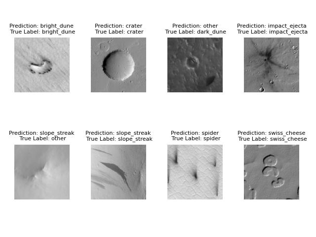

# TaskNet for HiRISE classification

## Install dependencies

`pip install -r requirements.txt`

## Download Dataset

https://zenodo.org/record/2538136#.X6I4SpNKjOQ

There are also some images in [samples folder](samples) on this repository. You can use them with simulator explained below.

## Setup Dataset

To split dataset into training and validation, run the following script on the directory where you want to place the dataset.

`python sort_hirise_dataset.py`

## Links to Pre-train Checkpoints

All checkpoints can be loaded by `keras.Model.load_weights()`

Model parameters

```
base model: efficientnetb0,
inserted bottleneck after: block4,
latent dimension: 8
trained with task-aware (lambda = 0)
```

### Edge Model

#### CPU model quantized as int8

https://drive.google.com/file/d/1I9reOFwOFC42DZ-qrOxfNrklFEFCOeUn/view?usp=sharing

#### TPU model compiled with coral edgetpu-compiler

https://drive.google.com/file/d/1oZ9o575MBto1B2lz0JSqExzDLZpahKQS/view?usp=sharing

### Cloud Model

runnable with an edge model together

https://drive.google.com/file/d/1B2PFR6SahASrN-9ajd8Qc_gliQmx4aTE/view?usp=sharing

### Full TaskNet sample

runnable standalone on CPU and GPU

https://drive.google.com/file/d/1V5JMbzwTVh-DcYqACyCOkUq_R_obRLpz/view?usp=sharing

## Running edge-cloud simulator with the trained models

download the edge and cloud models above and run simulator.py

```
$ python simulator.py --edge_model path_to_edge_model --cloud_model path_to_cloud_model --data_path data_path
Found 7303 images belonging to 8 classes.
batch 0 started
batch 100 started
 .
 .
loss: 0.39825, accuracy: 0.89073
```


## Run training

sample script is sample.sh

`python main.py --help` shows detailed explanation of commandline options
