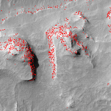
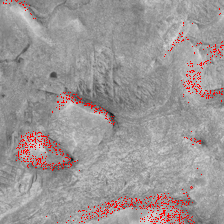
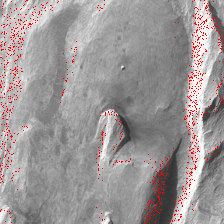

# TaskNet for Motion planning

## Install dependencies

`pip install -r requirements.txt`

`git clone https://github.com/MiaoDragon/Hybrid-MPNet`

Set env variable 'MPNET_LIB'

`export MPNET_LIB=Hybrid-MPNet_dir`

## Data

You can download the dataset from the following link.

https://drive.google.com/drive/folders/1oADJ85qxb3WKHXE4Bj6lwio-soGOktRa
https://github.com/ahq1993/MPNet

### Data Layout
Key Terms:

    - s2d: 2d environments
    - s3d: simple 3d envs
    - environments:
    - there are 110 envs
    - each env has several paths, where we get start/end from
    - envs 0 - 100 have training/test envs
        - paths 0-4K have TRAIN
        - paths 4K - 4.2K have 200 test paths
        - this is the 'seen test data'
    - envs 101-110 have TEST ENVS [never seen, 'unseen']
        - paths 0 to 2k have test data
    - examples of how this appears in code:

     unseen: 10, 2000, 100, 0
     training data: 100, 4000, 0, 0
        - means 100 train environments, 4000 paths, start env = 0, start path = 0
     TEST DATA
     seen: 100, 200, 0, 4000
        - means 100 test environments, 200 paths, start env = 0, start path = 4000
     unseen: 10, 2000, 100, 0
       - means 10 test envs, 2000 paths, start env = 100, start path = 0
     code instantiations:
      Training Data => --num_env 100 --num_path 4000 --start_env 0 --start_path 0 \
      Seen Test Data => --num_env 100 --num_path 200 --start_env 0 --start_path 4000 \
      Unseen Test Data => --num_env 10 --num_path 2000 --start_env 100 --start_path 0 \

### Mars terrain point cloud

https://drive.google.com/file/d/1zu0y3exVJb6LoTwUodHNP3D4ESnOU-vQ/view?usp=sharing

You can try path planning with pre-trained task-MPNet on the terrain data.
To do it, download model weights and dataset, then edit and run `plan_mars_terrain.sh`

The pre-trained model weights are on
https://drive.google.com/drive/folders/1-4lg8ychyDesaNqMub3O4-eATulOyLsq?usp=sharing

Please check comments in `plan_mars_terrain.sh` for details.

## Running tarining and test

run `python main.py --help` to see description of command options
