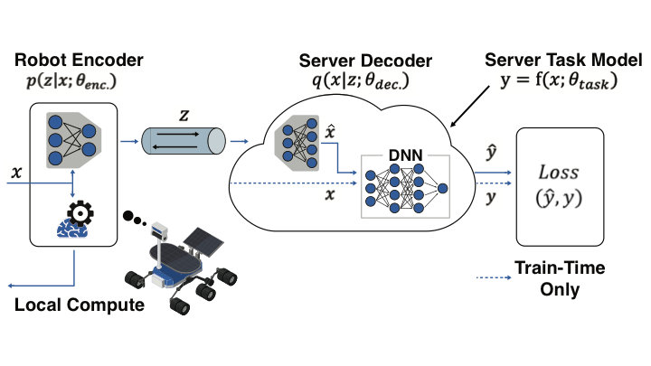

# TASK-RELEVANT REPRESENTATION LEARNING FOR NETWORKED ROBOTIC PERCEPTION

This is the implementation of TASK-RELEVANT REPRESENTATION LEARNING FOR NETWORKED ROBOTIC PERCEPTION.

A technical report is available at
https://sites.google.com/view/tasknet

There are 4 folders corresponding to each evaluation case.

- MNIST
- HiRISE
- Motion Planning
- iot timeseries

You can find further description in them.
